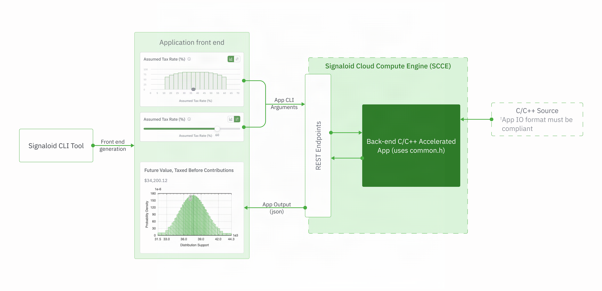
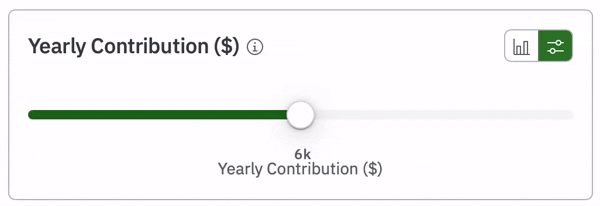
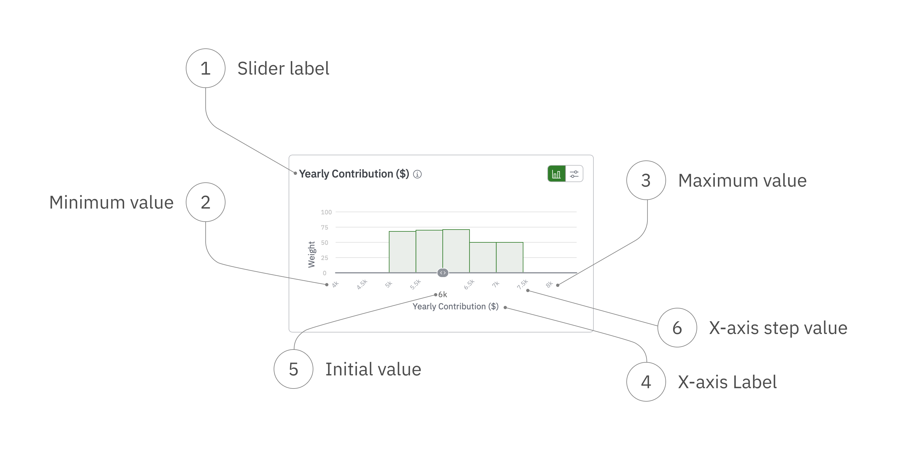

# Signaloid CLI Tool

The Signaloid CLI Tool generates a web front end for an existing application written in C/C++ that can run on the Signaloid Cloud Compute Engine and uses Signaloid’s UxHw. It creates a graphical interface for your application, to help you visualize how changes in the input parameters affect the distribution range of your application's outputs.

The generated web application interacts with the Signaloid Cloud Compute Engine to launch accelerated executions of the back-end application and returns its results.



## Requirements

### Installation Requirements
- [Node.js 24.x](https://nodejs.org/en/download/current) or higher
- git

### Other Requirements
- A [Signaloid API key](https://signaloid.io/settings/api). Sign in to the [Signaloid Cloud Developer Platform](https://signaloid.io), and go to `Settings > Cloud Engine API`. Enter the key name and generate a new key. Save the key somewhere safe as you will not be able to view it again.
- [GitHub Access Token](https://github.com/settings/tokens) with the following scopes: `repo` and `read:packages`. Read more about access tokens in [GitHub docs](https://docs.github.com/en/authentication/keeping-your-account-and-data-secure/managing-your-personal-access-tokens).
- A C/C++ application.
- To run C/C++ applications from private repositories, you need to [sign in to GitHub from the Signaloid Cloud Developer Platform](https://docs.signaloid.io/docs/platform/user-interface/repositories/github-login/).

### C/C++ Application Requirements

To work with the CLI tool, the inputs and outputs from the back-end C/C++ application must be in a format compatible with the front end generated by the Signaloid CLI Tool. The application must:

- accept command-line arguments
- export data in JSON format
- be stored in a GitHub repository

The default application when running the CLI Tool is the [Signaloid C application example](https://github.com/signaloid/Signaloid-CLI-Demo-C-Template). This is a basic working example that you can use when first runnning the CLI Tool. You can also use an application from another public Signaloid repository, such as the [Battery State Estimation Application](https://github.com/signaloid/Signaloid-Demo-Batteries-StateOfChargeEstimation), use an application you have created already if it has appropriate inputs and outputs, or [modify a custom application](#modifying-your-existing-cc-application). 

## Installation

1. Authenticate using your GitHub Access Token:
    ```
	echo "Enter your GitHub Access Token with read:packages and repo scopes:" && read -s GITHUB_TOKEN && npm config set @signaloid:registry https://npm.pkg.github.com/ && npm config set //npm.pkg.github.com/:_authToken $GITHUB_TOKEN
    ```
2. Install the Signaloid CLI Tool:
    ```
    npm install -g @signaloid/signaloid-cli
    ```

## Create and Configure a New Project

After installation, use the `signaloid-cli` command to initialize a new project:

```
signaloid-cli init web-app
```

During the initialization, configure the inputs when prompted to create a web demo of your C/C++ Signaloid application. Default values are provided for all inputs to help you get started configuring your first application.

### Configuration Options

> [!NOTE]
> For the default Signaloid C application, leave all of these options with their default values.

- Project name: The local directory for the CLI Tool to save the web app into.
- Title: The title at the top of the generated web app.
- Short description: Short description that will appear at the top of the web app.
- Core ID: The [Signaloid Core](https://docs.signaloid.io/docs/api/guides/execution-cores/) that the C/C++ source code will run on. Default value is the core ID of Signaloid C0Pro-M+.
- GitHub repository URL: The HTTPS URL of the GitHub repository containing your C/C++ application. Default value is https://github.com/signaloid/Signaloid-CLI-Demo-C-Template for the Signaloid CLI Demo C Template.
- Commit hash: Git commit hash that SCCE will build. Default value is `HEAD`.
- Branch name: Git branch that SCCE will build. Default value is `main`.
- Build directory: Directory in your repository containing the C/C++ Signaloid application source code. Default value is `src/`.
- Application general arguments: Optional command-line arguments that are required for your C/C++ application to run. Default value is empty.

### Configuration Options for Interactive Inputs

Your web app can have one or more interactive inputs that can dynamically pass data to your C/C++ application.

Specify the number of these inputs in the following prompt (default value is 1):
```
⚙️  Configuring interactive inputs...
✔ How many inputs will your application have?
```

> [!NOTE]
> For the default Signaloid C application, create 1 input of a distributional slider, with argument flag `-k`.

For each one of these inputs, you need to specify:
- Type - the type of interactive front-end element and its data type. Select from:
  - Basic slider: a single numeric value.

    
  - Distributional slider: a numeric distribution. 

    
  - Number input: a box to enter a number.
  - Multiple choice: a radio button to choose one of the defined options.
- Argument flag - the command-line option that will pass this input data to the C/C++ Signaloid application.
- Component elements in the diagram below:

  

## Run the Application

Once you have finished configuring your application, change to the project's directory and run:

```shell
npm start
```

## Example Installation and Configuration Animation


*This animation shows how to install the Signaloid CLI Tool and configure a new web application using the default Signaloid C application.*

## Modifying Your Existing C/C++ Application

To work with the CLI tool, the inputs and outputs from back-end C/C++ applications must be in a format compatible with the front end generated by the Signaloid CLI Tool. While inputs are mostly scalars and Ux Strings, outputs must be formatted as JSON. To convert the output to JSON, Signaloid provides [common utility routines](https://github.com/signaloid/Signaloid-Demo-CommonUtilityRoutines) - a small library which can parse arguments and prepare the output.

### Example of a Modified C Application

This is a [minimal C code application](https://github.com/signaloid/Signaloid-CLI-Demo-C-Template/blob/main/src/main.c) that is compatible with the Signaloid CLI Tool. The application has an input parameter `commandLineArgDistributionalInput` with command-line argument `-k`. Using `parseDoubleChecked`, the application can parse both scalar floating-point values and [Ux Strings](https://docs.signaloid.io/docs/hardware-api/ux-data-format/).

To make the output suitable for the Signaloid CLI Tool, it then uses `jsonOutputVariables` and `printJSONVariables` from `common.h` to format the output in JSON format.
